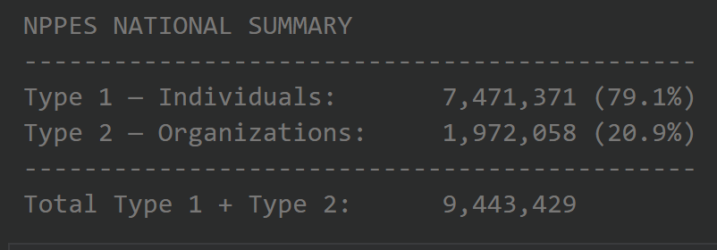
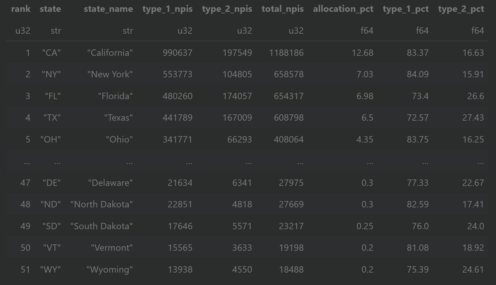
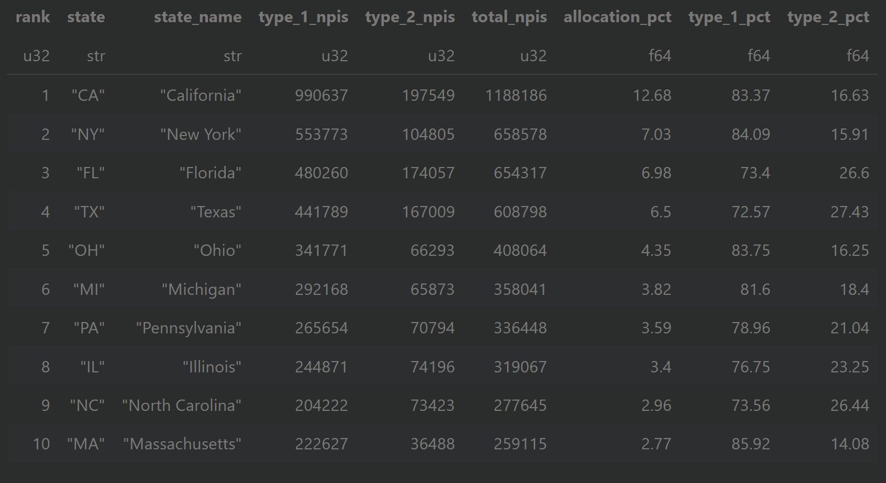

# NPPES Registry Pipeline, Analysis, & Visualization 
A data pipeline pulling the current CMS NPPES registry and a data analysis on NPIs nationwide 

# Table of Contents
- Background

- Sourcing

- Pipeline

- Analysis

- Outputs

- Viz

- Conclusion

- Resources

# Background
The NPPES Registry (National Plan and Provider Enumeration System) is a system that contains all NPIs (National Provider Identifiers) issued by CMS (Centers for Medicare and Medicaid). 

It is publicly available to be searched, downloaded in full, or queried via API. Healthcare organizations often utilize the registry to verify information about healthcare providers or organizations. It provides information such as the provider's name, the NPI type, specialty and taxonomy information, the physical and mailing addresses, telephone numbers, and more. 

There are two types of NPIs; Type 1 NPIs are for individual healthcare providers (such as physicans, or other clinically licensed medical professionals such as physican assistants, nurse practitioners, dentists, therapists, pharmacists, and more) while Type 2 NPIs are for healthcare organizations (such as hospitals, clinics, nursing homes, or other facilities/entities where healthcare is provided or enabled). Important Note: CMS explicitly states that issuance of an NPI does not mean the provider has active licensure. 

A major complexity of provider credentialing in healthcare lies in the distinction between Type 1 and Type 2 NPIs and how they are utilized. A Doctor who is registered with a Type 1 NPI may be working for a hospital with a Type 2 NPI and both NPIs might be used for verifications and transactions in different, overlapping, or inconsistent ways. For these reasons, it becomes especially hard for healthcare-enabling organizations in the US such as payers and clearinghouses to understand who is participating in care and create a clear chain of events that have occurred, as well as to detect fraud, waste, and abuse.

Fun fact: There are also 'atypical providers' in healthcare, who are not registered providers with clinical licensure but may still have the ability to support care delivery such as community services like meals on wheels or a carpenter who builds wheelchair ramps that can be covered by insurance.

# Sourcing

The full NPPES V2 dataset is downloaded from CMS and stored locally as a ZIP archive.

https://download.cms.gov/nppes/NPI_Files.html 

The notebook requires the user to configure only the local data directory and downloaded filename. From there, the pipeline validates the source file, identifies and extracts the primary NPI provider CSV, and verifies that the required fields are present before analysis begins.

This approach keeps the original CMS source file intact while making subsequent processing reproducible from a single notebook.

# Pipeline

The pipeline uses Python and Polars to process the NPPES source data without requiring a database or external data-processing platform.

Processing flow:

NPPES V2 ZIP → Source Validation → CSV Extraction → Schema Validation → Lazy Data Load → Data Normalization → Quality Checks → National Aggregation → State Aggregation → Validation → CSV / Parquet Outputs

Only fields required for the analysis are selected from the 330-column source dataset. The pipeline also performs reconciliation and data-quality checks before producing the final analytical datasets.

# Analysis

### National NPI Summary

### State-Level NPI Analysis

### Top 10 States by NPI Population

# Outputs 

The pipeline produces four files:

nppes_national_summary.csv — National Type 1, Type 2, and total NPI counts and percentages.
nppes_state_summary.csv — Ranked state-level NPI counts, allocations, and Type 1/Type 2 composition.
nppes_state_summary.parquet — Efficient analytical version of the state-level dataset for downstream or future use.
analysis_metadata.csv — Source file, analysis timestamp, and key record counts for reproducibility.

# Viz

*Fancy graphics have not yet been created. TBD*

# Conclusion 

The analysis transforms the raw NPPES provider dataset into a concise view of the U.S. healthcare provider landscape across the 50 states and Washington, D.C.

The resulting dataset quantifies the national Type 1 and Type 2 NPI populations, ranks states by total NPI volume, measures each state's share of the analyzed U.S. market, and identifies differences in individual-versus-organization provider composition.

The project demonstrates a reproducible approach for turning a large public healthcare dataset into validated, analysis-ready information using Python alone.

# Resources

- NPPES Registry Direct Search 

https://npiregistry.cms.hhs.gov/search 

- NPPES Registry Data Info 

https://www.cms.gov/medicare/regulations-guidance/administrative-simplification/data-dissemination 

- NPPES Registry Data Download (Monthly NPPES Downloadable File Version 2 (V.2))

https://download.cms.gov/nppes/NPI_Files.html 

